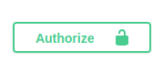
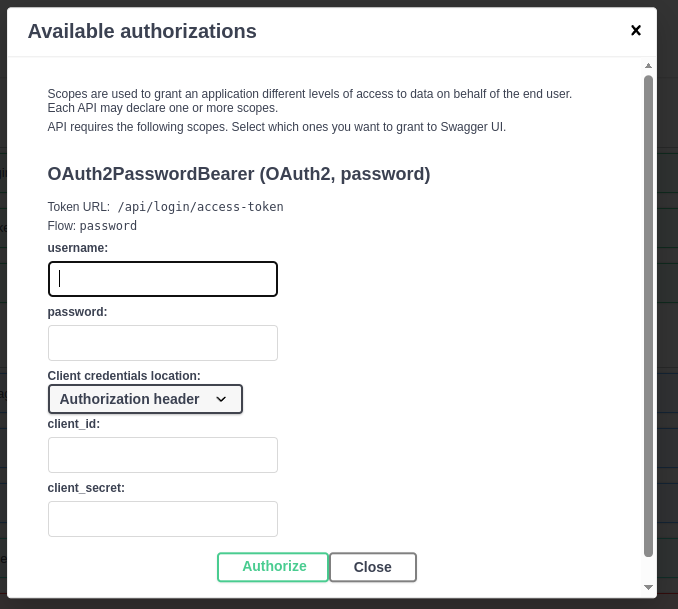

# GenAI Back-end
This is a back-end part of GenAI infrastructure.

📋 Key features:
- REST API endpoints
- Fully asyncronous
- Swagger documentation
- Intuitive API input validation
- Websocket endpoints for internal communication
- Robust communication with other infrastructure entities
- Static input/output validation during the communication with other infra entities

## Local installation (without Docker)
Back-end part of the project was designed to be used with `python3.12` and is using `uv` as package manager.

## 🐍 Installing Python 3.12

### macOS
Using Homebrew:
```bash
brew install python@3.12
echo 'export PATH="/opt/homebrew/opt/python@3.12/bin:$PATH"' >> ~/.zshrc
source ~/.zshrc
```

### Linux (Debian/Ubuntu)
```bash
sudo apt update
sudo apt install -y software-properties-common
sudo add-apt-repository ppa:deadsnakes/ppa
sudo apt update
sudo apt install -y python3.12 python3.12-venv python3.12-dev
```

### Windows
1. Go to the [official Python downloads page](https://www.python.org/downloads/release/python-3120/).
2. Download the Windows installer.
3. Run the installer and **check "Add Python to PATH"**.
4. Complete installation with default settings.

## ⚡ Installing `uv` (package manager)

### macOS (with Homebrew)
```bash
brew install astral-sh/tap/uv
```

### Linux & macOS (via shell script)
```bash
curl -Ls https://astral.sh/uv/install.sh | bash
```

### Windows (via PowerShell)
```powershell
iwr -useb https://astral.sh/uv/install.ps1 | iex
```

After installation, run `uv --version` to verify.


## 📦 Installing Back-end dependencies with `uv`

With `pyproject.toml` and `uv.lock` in place:

### Install dependencies
```bash
uv venv   # Creates and activates a virtual environment
uv sync   # Syncs your environment with pyproject.toml and uv.lock
```

### Activate virtual environment
- **macOS/Linux:**
  ```bash
  source .venv/bin/activate
  ```
- **Windows (PowerShell):**
  ```powershell
  .venv\Scripts\Activate.ps1
  ```

You're now ready to run Back-end FastAPI app.

## Usage
### ⚠️ Back-end requires a Postgres Database instance in order to run. 
### 🔎 By default Back-end will be searching for the `postgres` database on the `localhost` on default `5432` port, with `DB_NAME`, `POSTGRES_USER`, `POSTGRES_PASSWORD` credentials that are set to `postgres`

You can override the configuration for postgres credentials with the following environment variables in your `.env` file ⚠️**in the root of the monorepo**⚠️
```sh
POSTGRES_HOST=localhost
POSTGRES_USER=mycoolpsqluser
POSTGRES_PASSWORD=verysecurepassword123
POSTGRES_DB=mydb
POSTGRES_PORT=5432
```
---
#### ⚠️ Do not forget to run migrations! 
#### ✅ `alembic upgrade head` will do the trick . 
### ❌ Back-end won't start if you omit migrations ❌
---
### ⚠️  Before starting your back-end app - make sure the [`router`](https://github.com/genai-works-org/genai-agentos/tree/main/router) service is up and running.

❓ **Still cannot connect to the `router`** ❓ 
Although we are recommending to run genai infra via `docker compose`, you need to make sure `router`'s process is up and running.

Double check the host of the `router` service. If you're running it without docker - host name will be just `localhost`, if both `backend` and `router` are running in the docker containers - ⚠️ **respective names of the containers (`backend` and `router`) are gonna be the host names** ⚠️

To override the default `router` host configuration, include:  
```sh
ROUTER_WS_URL=ws://localhost:8080/ws
```
in your `.env` file ⚠️**in the root of the monorepo**⚠️

---
### 🏃‍♂️ Running Back-end app
Make sure to change your current directory to `backend/` from the monorepo root if not done previously.

Running the app is as simple as `uv run main.py`. 

If you correctly configured the database credentials and ran migrations the app will be running successfully 🎉

### License
TODO:

## GenAI Backend Development Notes
Back-end is built on the [`FastAPI`](https://fastapi.tiangolo.com/) as HTTP framework for REST API and Websocket communication.

This project is heavily relying on [`Pydantic`](https://docs.pydantic.dev/latest/) models (schemas) to achieve robustness and type validation on runtime of different JSON structures.

This project uses SQLAlchemy 2.0 syntax for ORM model definitions. Learn more: https://docs.sqlalchemy.org/en/20/

ORM layer logic resides in the `src/repositories/` per every ORM model. Repository is a design pattern that abstracts the data processing logic under a certain interface and offloads the endpoint body from the business logic

The project is fully async - all of the database communication, REST API endpoints and Websocket endpoint are async. 

Due to the fact that Websocket endpoint is async, we can wait for the response of the Master Agent which is not a instant time response. The Websocket endpoint will not be blocking the requests from the `front-end`, data lookup consistency is achieved by `session_id` and `request_id`

### Communication with other infrastructure entities
---
Back-end's primary role is to  be a de-facto proxy between `front-end`, `master agent` and agents created by user.

---
### Communication with GenAI Session library
---
Back-end is de-facto useless without [`genai_protocol`](https://github.com/genai-works-org/genai-protocol) library. All of the GenAI infrasture pieces are tightly coupled together by design.

Architecturally, `back-end` is also recognized as **an agent** by the session library and the router.

## ⚠️ Important: there is a possible case whenever back-end can start sending the logs to itself as an agent. To make sure that does not occur - pass `send_logs=False` flag to the `await session.process_events(send_logs=False)` clause ⚠️

As said earlier, since back-end is an agent, it needs to run `genai_session.process_events(send_logs=False)`.

Also, due to the nature of the `genai_session` library architecture - the following construction is required during the application lifespan context manager in `main.py`:
```python
@session.bind()
    async def message_handler()
```


Message handler is used to retrieve the data from the agents, `back-end` expects the following fields:
```python
message_type: str,
log_message: Optional[str],
log_level: Optional[str],
agent_uuid: str,
agent_description: Optional[str] = "",
agent_input_schema: Optional[dict] = None,
agent_name: Optional[str] = "",
session_id: str = "",
request_id: str = "",
```

`message_type` is always one of the enum types - 
```python
AGENT_REGISTER = "agent_register"
AGENT_UNREGISTER = "agent_unregister"
AGENT_INVOKE = "agent_invoke"
AGENT_RESPONSE = "agent_response"
AGENT_ERROR = "agent_error"
AGENT_LOG = "agent_log"
ML_INVOKE = "ml_invoke"
```
Currently backend is processing only `agent_register`, `agent_unregister` and `agent_log` events.

Other fields are pretty much self-explanatory

---

`session_id` and `request_id` are the identifiers that are generated whenever `front-end` opens a Websocket connection with the `back-end` and sends the message with the following structure:
```json
{
        "message": "What is the time in kyiv rn?",
        "llm": {
            "llm_name": "mymodelconfig"
        },
        "files": [
            "55704c5d-2d9b-4e5a-9d01-c6816cac5aa2",
            ...
        ]
    }
```
where all json fields are optional, except for the `message`.

`mymodelconfig` is the name of the model configuration that contains the information about the model selection, API keys, etc. You can create this config either via UI or POST request to the `/api/llms/model_config` endpoint. The value of the `api_key` will be encrypted.

**If front-end message is malformed, message about the validation error is returned**

## Incoming front-end message enrichment and forwarding to Master Agent
Master agent is architecturaly also an agent (duh), which is being invoked via
```python
await session.send(
    client_id=MasterServerName.MASTER_SERVER_ML.value,
    message=req_body,
)
```
in `src/routes/websocket.py`.

The enrichment process includes: 
- including `session_id`, `request_id` to the Master Agent invocation
- querying all of the agents and flows that belong to the current user and serializing it to the structure expected by the Master Agent
- adding the file metadata (if initial `front-end` message has included them, **files are optional**), patching received file metadata by attaching `session_id` and `request_id`

As a result, `back-end` is waiting for the Master Agent response with the following structure:
```json
{
  "type": "agent_response",
  "response": {
      "is_success": true,
      "execution_time": 4.310033996000129,
      "response": {
          "agents_trace": [...],
          "response" "The current date is ...",
          "is_success": true,
      },
      "files": [
          {  
              "id": "55704c5d-2d9b-4e5a-9d01-c6816cac5aa2",
              "session_id": "f24f3b3a-54b4-4cd3-a398-dc475b6b2ab4",
              "request_id": "49d7aaaf-a173-4a9f-a84c-29dbb5f8b50e",
              "original_name": "photo_2025-02-21_19-57-18.jpg",
              "mimetype": "image/jpeg",
              "internal_id": "55704c5d-2d9b-4e5a-9d01-c6816cac5aa2",
              "internal_name": "55704c5d-2d9b-4e5a-9d01-c6816cac5aa2.jpg",
              "from_agent": false
          },
          ...
      ]
  }
}
```
files are once again optional in the response body.

Once the response is received from the Master Agent, it is being sent over to the `front-end` with the same structure as it was received from the Master Agent.

## Other
To get to the swagger documentation page - visit root url - `/` or `/docs`.

To authenticate in the swagger docs - click on the `Authorize` button in the top right side of the docs page:



Provide your credentials in the following pop-up menu:



⚠️ Ignore `client_id` and `client_secret` fields in the pop-up menu.

✅ Once authenticated, you can access protected endpoints in the docs.

